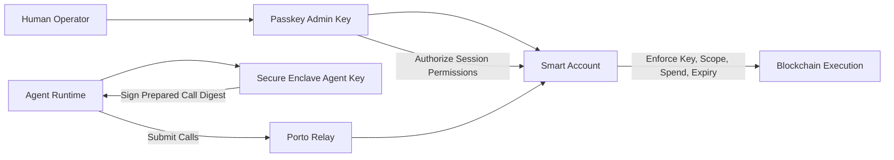

# Agent Wallet

Secure-by-default wallet CLI for autonomous agents.

Goal:
- Give an agent a real wallet with hardware-backed signing and least-privilege execution defaults.
- Keep backend/provider details secondary to the operator experience.

Current backend: Porto.

## Status
Work in progress.

Current code includes a functioning TypeScript scaffold with:
- macOS Secure Enclave signing backend
- Porto onboarding/permissions/send integration
- e2e test harness

Security note:
- Current implementation stores Secure Enclave opaque handle in config.
- Follow-up: move this handle to OS keychain storage.

## CLI Surface
Top-level commands:
1. `agent-wallet configure`
2. `agent-wallet sign`
3. `agent-wallet status`

Rationale:
- `configure`: one-shot account setup (create/reuse account + authorize local agent key + apply default policy envelope).
- `sign`: execute/sign actions within granted policy scope.
- `status`: inspect account, key backend, permissions, and balance.

MVP bootstrap scope:
- Local-admin bootstrap only (configure and passkey admin ceremony on the same machine).
- Remote-admin bootstrap (admin ceremony on separate device) is deferred to a later version.

Porto should remain visible as "powered by Porto", but not drive primary command naming.

## Multi-Account Direction
- Multiple accounts should be first-class.
- Account selection should use `--account <address-or-alias>`.
- Alias + default account support should be added in config model.

## Output Strategy (MVP)
- Global flags: `--json` and `--human`.
- `configure`: human-first, JSON available.
- `sign`: JSON-first.
- `status`: human-first by default, JSON available.
- Commands should use one logic path and separate renderers (machine output must stay clean on stdout in JSON mode).

## Design Principles
- Security-first defaults
- Non-extractable private key material
- Policy-bound autonomy (expiry, spend limits, allowlists)
- Clear machine-readable outputs/errors
- Strong non-interactive ergonomics for agent environments

## Security Model
This follows Porto's delegated-key model with hardened local signing:

- The smart account is the enforcement boundary.
- The human operator authenticates with a passkey admin key (WebAuthn).
- Local passkey authorization requires explicit user interaction, so the agent cannot silently self-authorize by itself.
- The agent uses a Secure Enclave-backed P-256 key that is non-extractable.
- The admin grants scoped permissions to the agent key.
- On every execution, the smart account enforces key binding, call scope, spend limits, and expiry.

What this protects well:
- Agent cannot leak raw private key material from Secure Enclave.

What remains risky:
- An agent can still issue unintended commands if instructed to do so.
- Mitigation is strict least-privilege permissions, short expiry windows, and easy revoke/rotate workflows.
- In MVP local-admin mode, compromise of the agent host can still trigger admin-approval attempts on that host.

## Custody and Portability
- Key custody is non-custodial: agent and admin keys are controlled by the user (not held by a third-party custodian).
- Current execution path uses Porto infrastructure, but custody remains with user-controlled keys.
- Architecture intent is backend portability via an internal provider adapter (Porto first, others possible later).
- This is not "zero dependency", but it is designed to avoid provider custody lock-in.



## Development
Install/build:
```bash
npm install
npm run typecheck
npm run build
```

Current command surface:
```bash
node dist/agent-wallet.js configure --calls '[{"to":"0xabc..."}]' --testnet
node dist/agent-wallet.js sign --calls '[{"to":"0xabc...","data":"0x","value":"0x0"}]'
node dist/agent-wallet.js status --human
```

Spec source of truth:
- `/Users/jean/src/github.com/jeanregisser/agent-wallet/docs/cli-spec.md`

## Near-Term Priorities
- Move signer handle persistence into keychain.
- Add remote-admin bootstrap as a post-MVP mode.
- Evaluate additional backend adapters later (e.g., ZeroDev, Privy, Para, others) if they improve the security/operability tradeoff.
