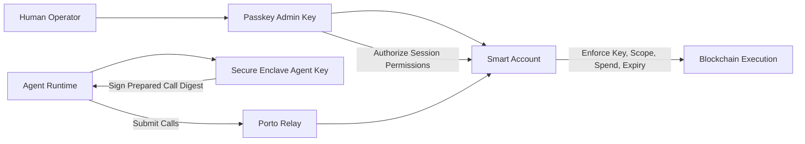

# CLI Spec (v0.2)

## Product Direction
`agent-wallet` is a security-first wallet CLI for autonomous agents.

Primary user promise:
- Give an agent a wallet that can act autonomously with tight, inspectable policy boundaries.
- Keep private key operations hardware-backed and non-exportable by default.
- Minimize footguns in non-interactive/automation contexts.

Porto is currently the execution backend, but not the user-facing mental model.

## Design Principles
- Security-first defaults: deny by default, grant least privilege.
- Non-exportable signing keys: private key material never returned to user-space.
- Policy-bound autonomy: expiry, spend constraints, and call allowlists.
- Operational clarity: predictable JSON outputs and actionable errors.
- Explicit interactivity: interactive steps fail clearly in headless environments.

## Scope & Constraints (MVP)
- Language/runtime: TypeScript on Node.js ESM.
- Signer backend: real macOS Secure Enclave now; backend interface for future platforms.
- Config path: platform-standard user config directory with `AGENT_WALLET_CONFIG_HOME` override.
- Backend today: Porto.
- Setup mode for MVP: local-admin only (same device runs configure and passkey ceremony).
- Security follow-up: move signer opaque handle from config into OS keychain storage.

## Security Model (Porto-Derived)
Core entities:
- Smart account onchain (policy enforcement point).
- Human admin key (passkey/WebAuthn) with full administrative authority.
- Agent key (P-256, Secure Enclave-backed, non-extractable) used for autonomous operations.

Trust and enforcement:
- Human admin authorizes agent key permissions on the smart account.
- Local passkey authorization requires user interaction (presence/verification), so the agent cannot silently self-authorize.
- Agent key can sign, but only within granted policy boundaries.
- Smart account enforces policy on every call (scope, spend, expiry, and key binding).
- Agent private key cannot be exported from Secure Enclave by design.

Primary residual risk:
- Prompt/tool misuse can cause unintended calls to be requested.
- Mitigation is least-privilege permissions, short expiries, and revocation/rotation.
- Local-admin note (MVP): if the admin passkey is used on the same host as the agent runtime, host compromise can still drive approval attempts.



## Canonical UX (Target)
Three user-facing commands:

### 1. `agent-wallet configure`
Configures one account end-to-end:
- create or reuse account
- initialize/reuse local agent signing key
- grant default permissions (with optional overrides) using Porto precalls
- report explicit permission state as `active_onchain` or `pending_activation`

Expected characteristics:
- idempotent when re-run
- interactive by default
- clear non-interactive error with required flags/hints
- explicit human progress output with phase + step context
- per-step operator guidance (`Now`, `You`, result, and next action on failure)

MVP policy:
- `configure` supports local-admin setup only.
- Remote-admin/out-of-band setup (admin ceremony on another device) is explicitly deferred.

Idempotency and recovery semantics (required):
- `configure` must reconcile from partial state and converge to one valid target state.
- Re-running `configure` must never create duplicate signer keys, duplicate permission grants, or conflicting default profiles.
- `configure` should evaluate and repair these checkpoints in order:
1. account selected or created
2. local Secure Enclave agent key present and usable
3. current permission state resolved (`active_onchain` vs `pending_activation` vs missing)
4. agent key permission envelope prepared (or renewed) through precall grant when required
5. required permission envelope state classified and persisted for reruns
6. final state clearly reported as `active_onchain` or `pending_activation`
- If execution stops mid-run, the next run should continue from remaining checkpoints instead of restarting everything.
- `configure` should report step outcomes with checkpoint statuses (`already_ok`, `created`, `updated`, `skipped`, `failed`) in the human flow summary.
- checkpoint identifiers in output are:
  - `account`
  - `agent_key`
  - `permission_state`
  - `permission_preparation`
  - `permission_classification`
  - `outcome`
- `configure` should run as explicit linear phases:
1. account + signer readiness
2. permission reconciliation and precall preparation
3. state classification and operator guidance
- each step should print:
  - phase/step position
  - what is happening now
  - what the human must do (or that no action is required)
  - success/failure for that step
  - actionable next step if failed
- MVP interaction rule: once an account address is configured, permission reads/reconciliation must not trigger a new dialog connect just to inspect state.
- Current MVP implementation resolves active permissions from Relay key state (`wallet_getKeys`) for non-interactive reconciliation and send-path selection; locally persisted `permissionIds` are treated as cache only (no `latestPermissionId` pointer is used).
- `configure` is Porto-precall-first: it should not require funding or a direct activation send during setup.
- `configure` should avoid hidden fallback behavior and report explicit state outcomes.
- `configure` should not enqueue duplicate precalls for the same desired permission envelope on rerun.
- `configure` must not add hidden self-call allowances to the granted calls envelope.
- `configure` should reject insecure broad self-call entries (`to: <account-address>` without a specific selector/signature) with an actionable error.
- If desired permissions changed while previous setup is still pending, `configure` may queue a new precall but must report queueing risk and current state clearly.
- `configure` output must always include an explicit state line:
  - `active_onchain`: Relay `wallet_getKeys` confirms agent permissions are active onchain.
  - `pending_activation`: grant/precall completed, but Relay does not yet show active onchain permission.
- Deferred activation model: first successful real send may consume matching precalls and transition state to `active_onchain`.

Porto precall semantics (operator-facing):
- `wallet_grantPermissions` in configure prepares permission intent without requiring an immediate onchain send.
- Relay key reads (`wallet_getKeys`) reflect active onchain key state, not every queued precall intent.
- Configure persists one local `pendingPermission` record to keep reruns idempotent and avoid duplicate precall grants for the same envelope.
- First matching allowlisted `agent-wallet sign` send can consume prepared precalls and activate the permission onchain.
- If permission intent changes before activation, configure may enqueue a newer precall and should report that state as `pending_activation` until Relay key state confirms activation.

### 2. `agent-wallet sign`
Agent execution/signing command.

For MVP this is call-bundle oriented:
- prepare calls
- sign digest using local hardware-backed key
- submit prepared calls
- return both relay bundle id and send status
- avoid ambiguity between relay and chain identifiers: `bundleId` is relay-only, `txHash` is onchain-only

Advanced/raw signing is out of scope for MVP.

### 3. `agent-wallet status`
Inspection command.

Should include:
- active account/profile
- backend/provider in use
- activation state (`active_onchain`, `pending_activation`, or `unconfigured`)
- key backend health
- granted permissions summary + expiry
- balance snapshot per configured chain

MVP status behavior:
- `status` permission summary is derived from Relay key state and does not initiate a dialog connect.
- If no active agent permission is found on Relay, permissions summary reports zero and should be interpreted as unconfigured/expired until `configure` grants/renews one.

## Account Model
- Multiple accounts are first-class in the data model.
- Selection key: `--account <address-or-alias>`.
- Alias support should be supported in config and surfaced in `status`.
- If no account is passed, use configured default account.

## Internal Architecture
- Keep provider details behind an adapter boundary.
- Current adapter: Porto.
- Keep “Powered by Porto” visible in docs/version/status output.
- Avoid premature multi-provider abstraction complexity until a second backend is real.

## Custody Stance
- Key custody is user-controlled and non-custodial.
- Provider infrastructure (currently Porto) is an execution dependency, not a key custodian.
- Project goal is low provider lock-in through adapter boundaries, without claiming infrastructure independence.

## Output Contract
Global output modes:
- `--json`: machine-readable output (stable schema).
- `--human`: operator-friendly output (tables/messages).

Command defaults (MVP):
- `configure`: human-only interactive flow (progress text is the contract).
- `sign`: json-first, with optional concise human summary.
- `status`: human-first by default, with full `--json` parity.

Implementation rules:
- Commands must use a single business-logic path and separate renderers.
- JSON mode writes only JSON to stdout.
- Human logs/progress/spinners must not be mixed into JSON stdout.
- Errors must preserve structured codes/details in JSON mode.
- `configure` is an exception: it is human-output only and should reject `--json`.

## Error Model
All command failures return:
```json
{ "ok": false, "error": { "code": "...", "message": "...", "details": {} } }
```

Interactive command in non-interactive context returns:
```json
{
  "ok": false,
  "error": {
    "code": "NON_INTERACTIVE_REQUIRES_FLAGS",
    "message": "Command requires an interactive TTY. Re-run with explicit flags or --headless."
  }
}
```

## Testing (E2E)
Strategy:
- Prefer a small number of scenario tests with broad coverage over many narrow tests.
- Each feature test should validate behavior plus the key invariants that prevent regression slope.
- Every top-level feature must have at least one robust e2e scenario.

Required scenario set (concise but high-signal):
1. `configure.e2e`
- Happy path: creates or reuses account and grants agent key permissions.
- Security invariant: resulting permissions are scoped; state is explicitly reported as `active_onchain` or `pending_activation`.
- Recovery invariant: rerun is idempotent and does not duplicate keys/grants.
- Output invariant: human flow markers appear in order (phase/step/now/result), include state classification, and include actionable guidance.
2. `sign.e2e`
- Happy path: allowed call succeeds.
- Security invariant: disallowed call fails with structured error code.
- Output invariant: JSON response schema is stable.
3. `status.e2e`
- Happy path: reports account, permissions summary, and balances.
- Output invariant: both `--json` and `--human` modes work.
4. `non-interactive.e2e`
- Invariant: interactive-only operations fail fast with actionable structured error in non-interactive contexts.

Notes:
- E2E defaults to testnet (Base Sepolia + faucet funding) for automation reliability, with optional prod override for manual smoke checks.
- E2E files live under `test/e2e` and use the `*.e2e.ts` naming convention.
- E2E tests run as the dedicated `e2e` Vitest project.
- E2E scenarios run in live mode only.
- `configure` happy-path e2e must automate the full browser passkey ceremony.
- Browser passkey automation uses Playwright virtual authenticators (`WebAuthn.addVirtualAuthenticator`) so registration + assertion are exercised in tests.
- Current test defaults:
  - `AGENT_WALLET_E2E_NETWORK=testnet` (default when unset)
  - optional `AGENT_WALLET_E2E_NETWORK=prod` override
  - optional `AGENT_WALLET_E2E_DIALOG_HOST=<host>` override
  - optional `AGENT_WALLET_E2E_HEADLESS=0` to run browser visibly for manual debugging
  - optional `AGENT_WALLET_E2E_STRICT_DIALOG=0` to tolerate non-actionable follow-up dialog URLs (debug-only)

## Current Implementation Note
Current codebase now exposes the top-level command surface:
- `agent-wallet configure`
- `agent-wallet sign`
- `agent-wallet status`

Porto remains an internal adapter and is not exposed as a dedicated CLI command group.

## Next Iteration Checklist
- [x] Replace user-facing `porto` command group with `configure`, `sign`, `status`.
- [ ] Introduce account profile model with alias + default selection.
- [x] Keep Porto adapter internal and non-primary in CLI docs/help.
- [x] Implement global `--json` / `--human` output modes with per-command defaults.
- [ ] Move Secure Enclave opaque handle storage from config to keychain item.
- [x] Add E2E coverage for new top-level command surface.
- [ ] Add remote-admin setup mode (out-of-band admin ceremony from separate device).
- [ ] Evaluate additional backend adapters (e.g., ZeroDev, Privy, Para, others) using security/custody/lock-in criteria before adding support.
