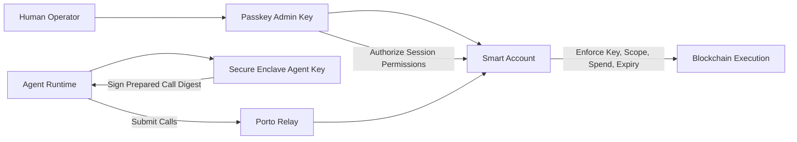

# CLI Spec (v0.2)

## Product Direction
`agent-wallet` is a security-first wallet CLI for autonomous agents.

Primary user promise:
- Give an agent a wallet that can act autonomously with tight, inspectable policy boundaries.
- Keep private key operations hardware-backed and non-exportable by default.
- Minimize footguns in non-interactive/automation contexts.

Porto is currently the execution backend, but not the user-facing mental model.

## Design Principles
- Security-first defaults: deny by default, grant least privilege.
- Non-exportable signing keys: private key material never returned to user-space.
- Policy-bound autonomy: expiry, spend constraints, and call allowlists.
- Operational clarity: predictable JSON outputs and actionable errors.
- Explicit interactivity: interactive steps fail clearly in headless environments.

## Scope & Constraints (MVP)
- Language/runtime: TypeScript on Node.js ESM.
- Signer backend: real macOS Secure Enclave now; backend interface for future platforms.
- Config path: platform-standard user config directory with `AGENT_WALLET_CONFIG_HOME` override.
- Backend today: Porto.
- Bootstrap mode for MVP: local-admin only (same device runs configure and passkey ceremony).
- Security follow-up: move signer opaque handle from config into OS keychain storage.

## Security Model (Porto-Derived)
Core entities:
- Smart account onchain (policy enforcement point).
- Human admin key (passkey/WebAuthn) with full administrative authority.
- Agent key (P-256, Secure Enclave-backed, non-extractable) used for autonomous operations.

Trust and enforcement:
- Human admin authorizes agent key permissions on the smart account.
- Local passkey authorization requires user interaction (presence/verification), so the agent cannot silently self-authorize.
- Agent key can sign, but only within granted policy boundaries.
- Smart account enforces policy on every call (scope, spend, expiry, and key binding).
- Agent private key cannot be exported from Secure Enclave by design.

Primary residual risk:
- Prompt/tool misuse can cause unintended calls to be requested.
- Mitigation is least-privilege permissions, short expiries, and revocation/rotation.
- Local-admin note (MVP): if the admin passkey is used on the same host as the agent runtime, host compromise can still drive approval attempts.



## Canonical UX (Target)
Three user-facing commands:

### 1. `agent-wallet configure`
Configures one account end-to-end:
- create or reuse account
- initialize/reuse local agent signing key
- grant default permissions (with optional overrides)
- optionally force account deployment/initialization transaction

Expected characteristics:
- idempotent when re-run
- interactive by default
- clear non-interactive error with required flags/hints

MVP policy:
- `configure` supports local-admin bootstrap only.
- Remote-admin/out-of-band bootstrap (admin ceremony on another device) is explicitly deferred.

Idempotency and recovery semantics (required):
- `configure` must reconcile from partial state and converge to one valid target state.
- Re-running `configure` must never create duplicate signer keys, duplicate permission grants, or conflicting default profiles.
- `configure` should evaluate and repair these checkpoints in order:
1. account selected or created
2. local Secure Enclave agent key present and usable
3. agent key authorized on account
4. required permission envelope present and active (or renewed)
5. optional deployment/initialization transaction completed (if requested)
- If execution stops mid-run, the next run should continue from remaining checkpoints instead of restarting everything.
- `configure` should emit structured status per checkpoint (`already_ok`, `created`, `updated`, `skipped`, `failed`) to make recovery observable for agents.

### 2. `agent-wallet sign`
Agent execution/signing command.

For MVP this is call-bundle oriented:
- prepare calls
- sign digest using local hardware-backed key
- submit prepared calls

Advanced/raw signing may stay available as an expert mode.

### 3. `agent-wallet status`
Inspection command.

Should include:
- active account/profile
- backend/provider in use
- key backend health
- granted permissions summary + expiry
- balance snapshot per configured chain

## Account Model
- Multiple accounts are first-class in the data model.
- Selection key: `--account <address-or-alias>`.
- Alias support should be supported in config and surfaced in `status`.
- If no account is passed, use configured default account.

## Internal Architecture
- Keep provider details behind an adapter boundary.
- Current adapter: Porto.
- Keep “Powered by Porto” visible in docs/version/status output.
- Avoid premature multi-provider abstraction complexity until a second backend is real.

## Output Contract
Global output modes:
- `--json`: machine-readable output (stable schema).
- `--human`: operator-friendly output (tables/messages).

Command defaults (MVP):
- `configure`: human-first, with `--json` fully supported.
- `sign`: json-first, with optional concise human summary.
- `status`: both human and json are first-class.

Implementation rules:
- Commands must use a single business-logic path and separate renderers.
- JSON mode writes only JSON to stdout.
- Human logs/progress/spinners must not be mixed into JSON stdout.
- Errors must preserve structured codes/details in JSON mode.

## Error Model
All command failures return:
```json
{ "ok": false, "error": { "code": "...", "message": "...", "details": {} } }
```

Interactive command in non-interactive context returns:
```json
{
  "ok": false,
  "error": {
    "code": "NON_INTERACTIVE_REQUIRES_FLAGS",
    "message": "Command requires an interactive TTY. Re-run with explicit flags or --headless."
  }
}
```

## Testing (E2E)
Required flows for target UX:
1. `agent-wallet configure` creates/reuses account and grants agent key permissions.
2. `agent-wallet status` shows account, permissions, and balances.
3. `agent-wallet sign` succeeds for allowed calls.
4. `agent-wallet sign` fails for disallowed calls.
5. Non-interactive mode returns actionable errors for interactive-only paths.

Notes:
- Testnet-first on live networks.
- Local deterministic tests allowed, but not a substitute for live integration checks.

## Current Implementation Note
Current codebase contains a work-in-progress command shape (`signer` and `porto` subcommands).
Given zero production users, compatibility is not required for the next iteration.

## Next Iteration Checklist
- [ ] Replace user-facing `porto` command group with `configure`, `sign`, `status`.
- [ ] Introduce account profile model with alias + default selection.
- [ ] Keep Porto adapter internal and non-primary in CLI docs/help.
- [ ] Implement global `--json` / `--human` output modes with per-command defaults.
- [ ] Move Secure Enclave opaque handle storage from config to keychain item.
- [ ] Add E2E coverage for new top-level command surface.
- [ ] Add remote-admin bootstrap mode (out-of-band admin ceremony from separate device).
